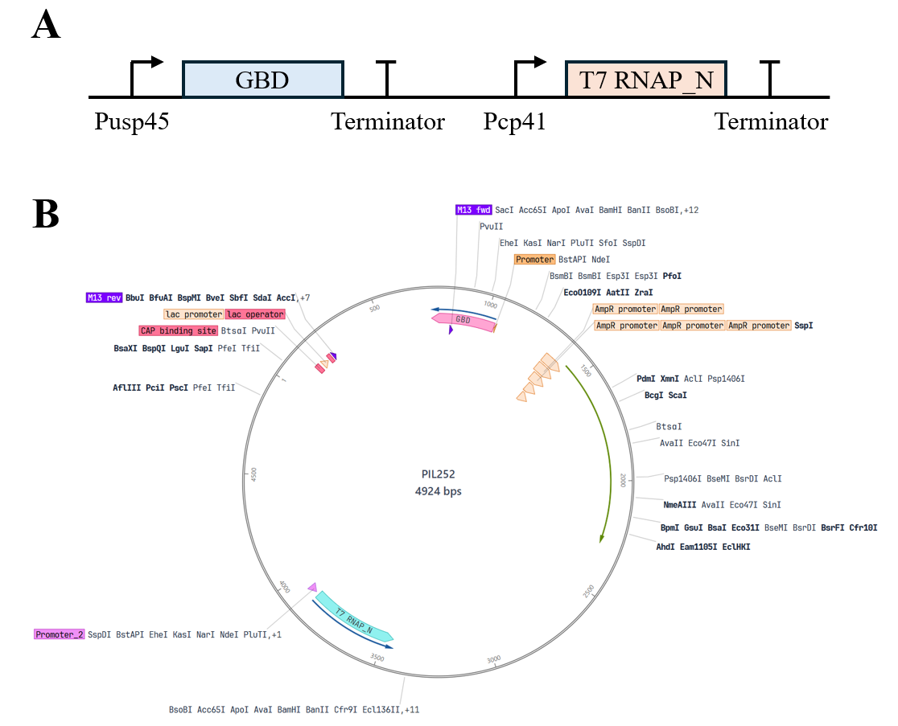
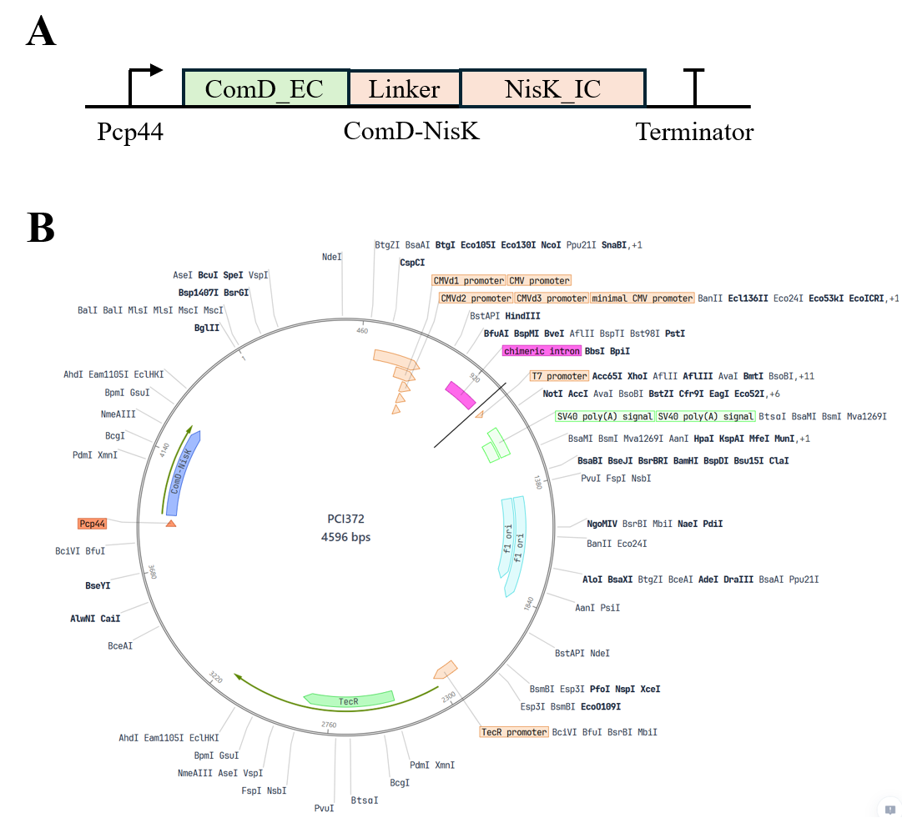
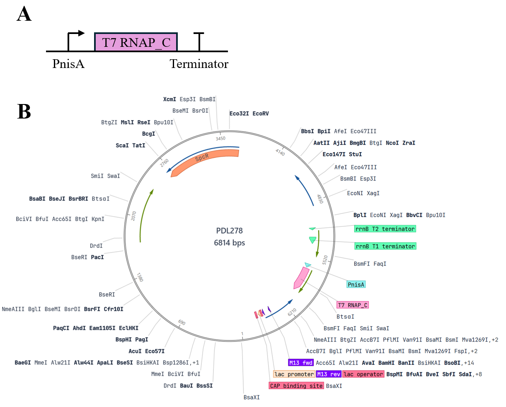
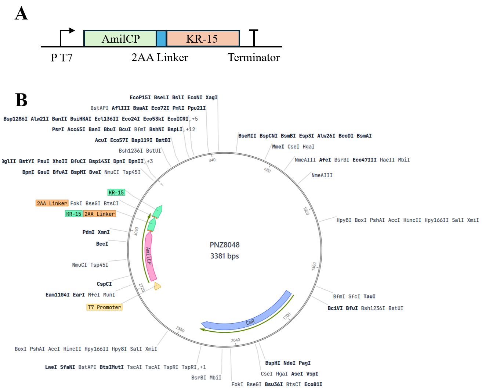

# Protocol

## Experimental Materials

The host chassis used in this study was wild-type *Lactococcus lactis* NZ9000 and its derived D-alanine racemase-deficient strain (*L. lactis* Δalr); the pathogenic model bacterium was the standard strain of *Streptococcus mutans* (*Streptococcus mutans* UA159); the mammalian cell line used was mouse embryonic fibroblast (NIH-3T3). The plasmid vectors used in the experiment included pNZ8148-derived vectors for lactococcal expression and a dual-plasmid orthogonal system. The main reagents included: D-alanine (D-Alanine, purity ≥ 99%), brain heart infusion broth (BHI), MRS broth, M17 broth, glucose, calcium chloride, lysozyme, ampicillin, chloramphenicol, and erythromycin, all purchased from Sigma-Aldrich or Sangon Biotech; fetal bovine serum (FBS), high-glucose DMEM medium, and penicillin-streptomycin double antibiotics were purchased from Gibco; the LIVE/DEAD BacLight Bacterial Viability Kit (SYTO-9/PI) was purchased from Thermo Fisher Scientific; the Calcein-AM/PI cell double staining kit was purchased from Beyotime Biotechnology; high-fidelity DNA polymerase, restriction endonucleases, and the ClonExpress II seamless cloning kit were purchased from Nanjing Vazyme Biotech. The main instruments included: multifunctional microplate reader (BioTek Synergy H1), laser confocal microscope (Leica TCS SP8), inverted fluorescence microscope (Olympus IX73), and microporous electroporator (Bio-Rad Gene Pulser Xcell).

## Preparation of Culture Systems

Basal MRS medium supplemented with 0.5% (w/v) glucose were prepared for *Lactococcus lactis* culture; BHI liquid and solid media containing 1% (w/v) sucrose were prepared for *Streptococcus mutans* biofilm formation and routine culture. For Δalr-deficient *Lactococcus lactis*, sterile D-alanine stock solution was added to basal MRS medium by serial dilution to prepare D-Ala-dependent with final mass concentration gradients of 21, 43, 85, 169, 338, 675 μg/mL and 1.25, 2.5, 5, 10 mg/mL, respectively; after sterile filtration, the medium was stored at 4°C protected from light for later use. NIH-3T3 cell culture medium was high-glucose DMEM basal medium containing 10% (v/v) heat-inactivated fetal bovine serum and 1% (v/v) penicillin-streptomycin.

## Bacterial Culture

Glycerol-stocked *L. lactis* and its derived strains were streaked onto MRS agar plates containing corresponding antibiotics and 2.5 mg/mL D-alanine, and cultured statically at 30°C for 36–48 h. Single colonies were picked and inoculated into fresh MRS liquid medium, and activated statically overnight at 30°C. *S. mutans* was inoculated onto BHI agar plates, placed in a microaerophilic/anaerobic incubator (85% N2, 10% CO2, 5% O2), and cultured at 37°C for 24–48 h; single colonies were picked and statically cultured in BHI liquid medium to logarithmic phase (OD600≈0.6).

## Colony Counting

When examining bacterial survival rate and self-destruction effect, fermentation broth or co-culture from each experimental group was taken and subjected to 10-fold serial dilution in sterile PBS. A 100 μL aliquot of each dilution gradient was spread onto MRS plates containing 2.5 mg/mL D-alanine or BHI plates, with 3 parallels set for each dilution. The plates were incubated at the corresponding culture temperature for 24–36 h, and plates with colony counts between 30 and 300 were selected for naked-eye counting; colony-forming units were expressed as CFU/mL.

## Preparation of Streptococcus mutans Culture

*S. mutans* culture activated to mid-logarithmic phase was inoculated at a ratio of 1:50 into fresh BHI liquid medium containing 1% sucrose, and anaerobically cultured at 37°C for 18 h to allow sufficient secretion of quorum-sensing signal molecule (CSP) and extracellular enzymes. The fermentation broth was centrifuged at 4°C, 8000×g for 15 min, and the supernatant was collected and sterilized by filtration through a 0.22 μm polyethersulfone membrane to obtain sterile conditioned culture supernatant; the bacterial pellet was washed and resuspended in sterile PBS and adjusted to a predetermined optical absorbance for later use.

## Construction of Expression System

Plasmid 1: pDS-const-GBD-T7L (basal expression plasmid)

This plasmid was constructed based on the stringent theta replication backbone pIL252 and contains two independent constitutive expression cassettes: a secreted GBD fusion expression cassette driven by the medium-strength promoter P_usp45 (ssUsp45-GBD-Linker-LPXTG), and a Split T7 RNA polymerase large fragment (Large Fragment) expression cassette driven by the weak promoter P_cp41. Its function is to maintain the basal characteristics of the chassis. On the one hand, through covalent display of the GBD domain on the cell wall, it specifically anchors the extracellular glucan (EPS) of *Streptococcus mutans*, endowing the engineered bacteria with biofilm adhesion ability; on the other hand, it stably provides the T7 polymerase large fragment substrate intracellularly for subsequent cascade assembly.

*Fig.1 Plasmid 1: pDS-const-GBD-T7L (basal expression plasmid)*

Plasmid 2: pDS-sens-ComDNisK (sensing module plasmid)

This plasmid was constructed based on the stringent theta replication backbone pCI372. Its core structure is a bicistronic unit driven by the weak constitutive promoter P_cp44, tandemly encoding the ComD-NisK chimeric kinase receptor and the cytoplasmic transcriptional regulator protein NisR. Its function is to perform specific sensing and transmembrane transduction of pathogenic signals, utilizing the transmembrane ComD domain to recognize in situ the CSP signal molecule secreted by *Streptococcus mutans*, inducing autophosphorylation of the intracellular NisK kinase domain and transphosphorylation activation of NisR, thereby converting the extracellular pathogenic microenvironment signal into an intracellular genetic circuit input.

*Fig.2 Plasmid 2: pDS-sens-ComDNisK (sensing module plasmid)*

Plasmid 3: pDS-relay-PnisA-T7S (relay switch plasmid)

This plasmid was constructed based on the stringent shuttle backbone pDL278. Its main structure is a Split T7 RNA polymerase small fragment (Small Fragment) expression cassette driven by the stringent inducible promoter P_nisA. Its function is to serve as the signal filter and primary conversion relay of the system. Under stimulation by activated NisR-P, it initiates induced expression of the T7 small fragment, and the small fragment then self-assembles with the large fragment expressed by Plasmid 1 into a transcriptionally active T7 RNAP holoenzyme, greatly reducing system background leakage through stringent replication and split complementation mechanisms.

*Fig.3 Plasmid 3: pDS-sens-ComDNisK (sensing module plasmid)*

Plasmid 4: pDS-eff-PT7-AmilCP-KR15 (effector output plasmid)

This plasmid was constructed by modification based on the high-copy rolling-circle replication backbone pNZ8048. Its structure contains the strong orthogonal promoter P_T7 and its downstream tandem dual effector expression cassette, sequentially arranging AmilCP chromoprotein and secreted hybrid peptide (ssUsp45-KR-15). Its function is to perform high-fold signal amplification and integrated diagnostic-therapeutic output. Under catalysis by the assembled T7 holoenzyme, it undergoes burst transcription, rapidly enriching AmilCP intracellularly to present a naked-eye-visible dark blue precipitate for early diagnosis of plaque, while secreting KR-15 outward to lyse *Streptococcus mutans* and block dental calculus mineralization.

*Fig.4 Plasmid 4: pDS-eff-PT7-AmilCP-KR15 (effector output plasmid)*

## Preparation of Competent Cells

Overnight-cultured *L. lactis* Δalr seed culture was inoculated at a ratio of 1:50 into SGM17 medium supplemented with 1% (w/v) glycine, 0.5 M sucrose, and 2.5 mg/mL D-alanine, and statically cultured at 30°C until OD600 reached 0.3–0.4. The culture flask was placed in an ice-water bath for precooling for 20 min, and cells were collected by centrifugation at 4°C, 4000×g for 10 min. The cell pellet was washed 3 times with ice-cold washing buffer (ultrapure water containing 0.5 M sucrose and 10% glycerol), and finally gently mixed with electroporation resuspension buffer at 1/100 of the original volume, aliquoted at 50 μL/tube, and immediately stored at -80°C.

## Plasmid Transformation

*L. lactis* Δalr competent cells were thawed on ice, 200–500 ng of purified recombinant plasmid DNA was added, gently mixed, and transferred to a precooled 1 mm gap electroporation cuvette, and allowed to stand on ice for 5 min. An electroporator was used with parameters set as: voltage 2.0 kV, capacitance 25 μF, resistance 200 Ω for a single electric pulse stimulation (time constant maintained at 4.5–5.0 ms). Immediately after electroporation, 950 μL of recovery medium prewarmed to 30°C (M17B broth containing 0.5 M sucrose, 20 mM MgCl2, 2 mM CaCl2, and 2.5 mg/mL D-alanine) was added, and static recovery culture was performed at 30°C for 2 h.

## Screening of Transformants

The recovered transformed bacterial suspension was centrifuged and resuspended in 200 μL medium, spread onto MRS selective plates containing corresponding antibiotics (e.g., chloramphenicol 5 μg/mL or erythromycin 5 μg/mL) and 2.5 mg/mL D-alanine, and incubated inverted at 30°C for 48–72 h until visible single colonies grew. Candidate single colonies were picked for colony PCR verification, and PCR products were confirmed for positive band size by agarose gel electrophoresis; positive recombinant clones were sent to a sequencing facility for bidirectional sequencing confirmation.

## Plasmid Extraction and Electrophoresis

Because the *Lactococcus lactis* cell wall is thick and the peptidoglycan network is highly cross-linked, enzymatic pretreatment was required before conventional alkaline lysis. Engineered bacterial cells in logarithmic growth phase were collected and resuspended in lysozyme buffer (20 mM Tris-HCl, pH 8.0, 2 mM EDTA, 1.2% Triton X-100, lysozyme final concentration 10 mg/mL), and incubated in a 37°C water bath for 60 min to fully disrupt the peptidoglycan layer. Subsequently, a high-purity plasmid extraction kit was used to purify plasmids by standard alkaline lysis centrifugation. The obtained plasmid DNA was electrophoresed on a 1.0% (w/v) agarose gel at 110 V for 30 min, and a gel imaging system was used to photograph and record band purity and integrity.

## Biofilm Formation Assay

The in vitro biofilm formation of *Streptococcus mutans* and the targeted integration of engineered bacteria were evaluated. Logarithmic-phase *S. mutans* was diluted to 1×10^6 CFU/mL, added to BHI medium containing 1% (w/v) sucrose, inoculated into a 24-well polystyrene flat-bottom cell culture plate (1 mL per well) or a confocal dedicated laser dish, and incubated at 37°C under anaerobic environment for 24 h to induce synthesis of a mature biofilm network coated by glucan-rich extracellular polysaccharide (EPS). The planktonic bacterial suspension was aspirated and discarded, and the plate was gently rinsed 3 times with sterile PBS to wash away non-adherent bacteria, obtaining an adherent biofilm model.

## Crystal Violet Staining

To quantitatively evaluate biofilm biomass and its clearance effect under the action of functional peptide, the formed biofilm was subjected to crystal violet microplate staining. After aspirating the liquid in the wells and rinsing with PBS, 500 μL methanol was added to each well for fixation for 15 min, the fixative was discarded, and the plate was air-dried naturally. Subsequently, 500 μL of 0.1% (w/v) crystal violet staining solution was added to each well, and staining was performed at room temperature protected from light for 20 min. The staining solution was aspirated and gently rinsed with deionized water until the eluate was colorless; after air-drying at room temperature, 500 μL of 33% (v/v) glacial acetic acid was added for destaining and fully shaken to dissolve bound dye, and the absorbance at 595 nm (OD595) of each well was measured using a microplate reader.

## Cell Culture

Mouse embryonic fibroblast NIH-3T3 cells were adherently cultured in high-glucose DMEM medium containing 10% FBS and 1% double antibiotics, and placed in a 37°C, 5% CO2 constant-temperature humidified incubator. When cell confluence reached 80%–90%, the original liquid was discarded, the cells were washed twice with sterile PBS, and 0.25% trypsin-EDTA digestion solution was added for digestion at room temperature for 2 min. After the cells contracted and became round, complete medium was added to terminate digestion, and the cell suspension was collected and centrifuged at 1000×g for 5 min; the supernatant was discarded, and the cells were resuspended and counted in complete medium, and inoculated into plates at a predetermined density for subsequent compatibility detection.

## SYTO-9/PI Bacterial Live/Dead Staining

To evaluate the lysis self-destruction phenotype of the Δalr deficiency switch under D-alanine-free conditions, *L. lactis* Δalr was inoculated in a 96-well plate and cultured for 12 h, then replaced with MRS medium without D-alanine (Control group) and normal MRS medium containing 2.5 mg/mL D-alanine (experimental group) and continuously incubated. The treated bacterial suspension was collected, washed and resuspended with sterile saline. According to the kit instructions, SYTO-9 and propidium iodide (PI) were mixed at a 1:1 ratio to prepare a double-staining working solution. An appropriate amount of staining solution was added to each tube of bacterial suspension, and incubated at room temperature protected from light for 15 min. A 5 μL aliquot of bacterial suspension was dropped onto a slide and mounted, and imaged under a laser confocal microscope. The excitation wavelength of SYTO-9 was 488 nm (emission filter 500–550 nm, labeling live bacteria showing green fluorescence), and the excitation wavelength of PI was 543 nm (emission filter 590–650 nm, labeling dead bacteria or bacteria with damaged membrane integrity showing red fluorescence).

## Calcein-AM/PI Cell Live/Dead Staining

A Transwell chamber system was used to co-culture NIH-3T3 cells with engineered bacteria (Engineered-Lactococcus) and blank MRS medium for 0, 1, 3, and 5 days, respectively, to monitor the long-term toxicity of the system to host cells. At each culture time point, the Transwell upper chamber was removed, and adherent NIH-3T3 cells were gently washed twice with PBS. Serum-free working solution containing 2 μM Calcein-AM and 4.5 μM PI was added, and the cells were incubated at 37°C protected from light for 30 min. After staining, the cells were observed under an inverted fluorescence microscope. Live cells were catalyzed by Calcein-AM to produce strong green fluorescence (Ex: 490 nm, Em: 515 nm), and dead cells took up PI due to membrane damage and showed red nuclear fluorescence (Ex: 535 nm, Em: 617 nm). Different fields were randomly collected for photography and recording, and cell survival status was counted.

## Bacterial Co-culture Experiment

A Transwell polycarbonate membrane microplate (pore size 0.4 μm) was used to construct a physically separated but molecularly permeable bacterial bistable co-culture system. Logarithmic-phase *S. mutans* suspension (1×10^8 CFU/mL) was inoculated in the Transwell upper chamber, and equal volumes of engineered bacteria (Engineered-Lactococcus), Δalr-Lactococcus empty vector control bacteria, and wild-type *Lactococcus* were inoculated in the lower chamber wells, and co-cultured at 37°C for 24 h. After culture, the lower chamber culture was taken out for digital photography to record the naked-eye visible chromogenic phenotype; subsequently, the culture broth was centrifuged at 4°C, 10000×g for 5 min to collect bacterial cells and supernatant enriched with AmilCP precipitate, and the optical absorbance (OD560) was measured using a microplate reader to quantify the expression accumulation intensity of the chromoprotein.

## Statistical Analysis

All quantitative experiments were repeated at least 3 independent biological experiments, and experimental data were expressed as mean ± standard deviation (Mean±SD). GraphPad Prism 9.0 software was used for graphing and statistical testing. Comparisons between two groups used the two-tailed unpaired Student's t-test, and comparisons among multiple groups used one-way ANOVA combined with Tukey's multiple comparison test. The significance criteria were set as follows: P&lt;0.05 indicates a statistically significant difference*, P&lt;0.01 indicates an extremely significant difference****, and P&lt;0.001 indicates a highly significant difference***.
