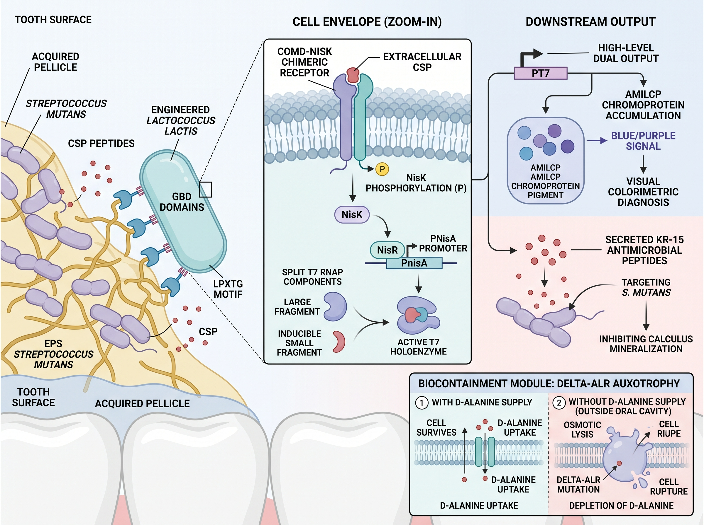

# Background

Dental caries is one of the chronic infectious diseases with the highest incidence worldwide. If not intervened in a timely manner, it often leads to irreversible dental hard tissue defects, pulp infection, and even tooth loss, imposing a heavy medical burden on public health systems. *Streptococcus mutans* is recognized as the core pathogenic bacterium in the occurrence and development of dental caries. Through glucosyltransferases (Gtfs), it synthesizes an extracellular polysaccharide (EPS) matrix rich in insoluble glucan, constructing a three-dimensional reticular biofilm with a high physical barrier effect. Within the biofilm microenvironment, bacteria utilize the competence-stimulating peptide (CSP)-mediated quorum-sensing system to coordinately regulate the burst of virulence factors, the acidogenic and acid-tolerant phenotype, and the acidification of the microecological environment, thereby inducing demineralization of dental hard tissues. However, current clinical diagnosis mostly relies on visual inspection and probing, naked-eye discrimination of dental demineralization white spots, and X-ray imaging examination. When the lesion is diagnosed, it has often already entered the stage of substantial destruction of enamel or even dentin; at the same time, commonly used clinical broad-spectrum antibacterial mouthwashes or mechanical scaling and removal strategies lack lesion specificity, easily disrupt the balance of normal oral commensal microbiota, and are difficult to achieve in situ precise blockade during the early window period.

The rapid development of synthetic biology technology and the emergence of living biotherapeutic products (LBPs) have opened up a new path for constructing intelligent live microecological diagnostic and therapeutic preparations with “sense-response” capability. *Lactococcus lactis*, as a food-grade lactic acid bacterium chassis that has obtained generally recognized as safe (GRAS) certification, has a clear genetic background and extremely low intrinsic pathogenicity, and has been widely used in mucosal drug delivery and intestinal microecological regulation [6]. To solve the problem that exogenous strains are difficult to persistently reside under the high-flow salivary shear stress in the oral cavity, using the endogenous Sortase A-mediated LPXTG cell wall anchoring mechanism of lactic acid bacteria to display glucan-binding domain (GBD) at high density on the bacterial cell surface can endow the chassis cells with the ability to specifically recognize and firmly bind to the EPS matrix of *Streptococcus mutans*, thereby enabling the engineered bacteria to autonomously target and enrich in the core of the microenvironment of early pathogenic plaque.

On the basis of targeted anchoring, constructing a low-leakage, high-response in situ sensing and signal cascade amplification circuit is the key to achieving early ultrasensitive diagnosis. Natural *Streptococcus mutans* utilizes the ComD-ComE two-component system to respond to extracellular CSP signals, whereas *Lactococcus lactis* relies on the nisin-induced NisK-NisR system to regulate PnisA promoter expression. By precisely fusing the ligand-binding and transmembrane sensing domain of ComD with the intracellular histidine kinase catalytic domain of NisK, a ComD-NisK chimeric receptor that orthogonally senses CSP can be constructed, enabling the originally exogenous quorum-sensing signal to activate the NisR phosphorylation cascade in the host cytoplasm. Given that the physiological concentration of free CSP in the oral microenvironment is relatively low, direct transcriptional output often faces the limitations of insufficient sensitivity and delayed chromogenesis. The introduction of split T7 RNA polymerase (Split T7 RNAP) as an orthogonal nonlinear signal amplifier, which assembles into a transcriptionally active holoenzyme complex only when the pathogenic signal reaches a critical threshold, can both effectively filter background leakage noise and trigger strong transcription after crossing the threshold. This orthogonal transcription machine drives the accumulation of the eukaryotic-derived blue chromoprotein AmilCP, utilizing its high-contrast physical color to achieve instrument-free in situ naked-eye readout; at the same time, the system is coupled with a secreted hybrid antibacterial peptide (KR-15), which, while targeted lysing *Streptococcus mutans*, blocks calcium-phosphate crystal precipitation, achieving in situ synergistic intervention at the lesion.

Although engineered live bacteria exhibit excellent diagnostic and therapeutic potential, the risks of horizontal transfer of genetic elements and ectopic colonization faced when they are released into the open oral environment have always been the main bottleneck limiting their clinical translation. The use of antibiotic resistance genes as selection markers not only poses safety hazards but also makes it difficult to meet pharmaceutical regulatory standards. Constructing an auxotrophy-based conditionally lethal biocontainment system has been proven to be a reliable strategy for ensuring environmental biosafety. D-alanine is a specific amino acid required for peptidoglycan cross-linking in bacterial cell walls, and it is catalyzed and synthesized in host bacteria by D-alanine racemase (Alr). Knockout of the *alr* gene in the chassis cells causes them to lose the ability to synthesize endogenous D-alanine. The engineered bacteria maintain normal growth only under the condition of D-alanine supplementation by specific exogenous preparations such as medical gel. Once they leave the supplementation environment or enter non-target tissues, the engineered bacteria rapidly lyse and self-destruct under osmotic pressure due to blocked peptidoglycan network synthesis, thereby eliminating the risk of exogenous gene escape.

Based on the above conception, this study designed and constructed an engineered *Lactococcus lactis* live diagnostic and therapeutic system integrating “biofilm surface display anchoring, cross-species chimeric signal sensing, nonlinear enzyme cascade amplification, instrument-free naked-eye direct-read chromogenesis, and auxotrophic self-destruction.” Through systematic condition screening and in vitro co-culture evaluation of key functional modules, this study deeply explored the regulatory patterns of chimeric receptor sequences on transcriptional output activity, verified the biocontainment switch and the naked-eye chromogenic diagnostic efficacy in co-culture, and evaluated the mammalian cell compatibility of the system, providing a new engineering solution for non-invasive, extremely early intelligent monitoring and in situ microecological regulation of occult pathogenic plaque in the oral cavity.
