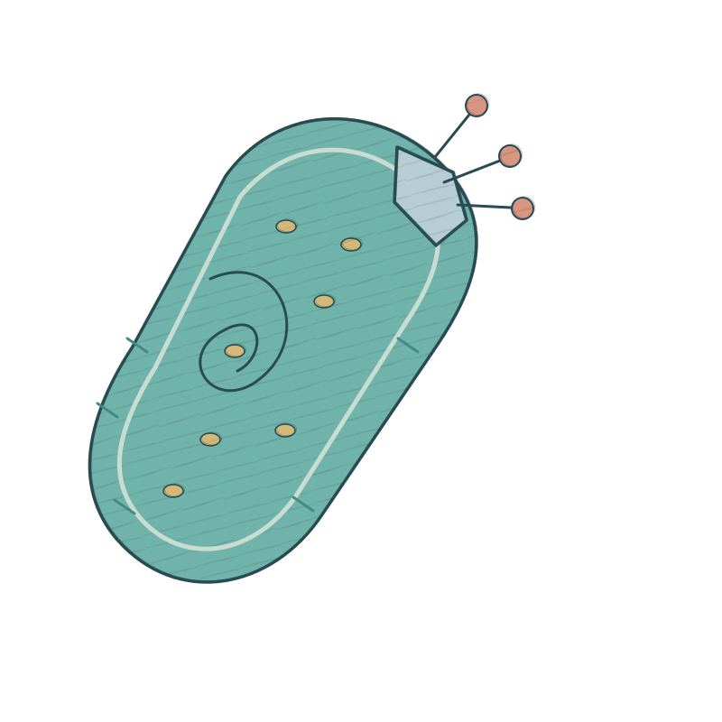

# Engineering { .engineering-page-title #engineering-page-title }

{ .engineering-hero-art }

## **Overview**

The objective of advancing the DENTAL SHIELD project is to address the challenge of early detection and treatment of the most prevalent oral diseases—namely, dental caries and periodontal disease. In this context, we designed and report an engineered Lactococcus lactis probiotic system, which primarily functions to identify danger signal molecules, specifically CSP (Competence Stimulating Peptide), from Streptococcus mutans, a key pathogenic bacterium and one of the most significant culprits responsible for dental caries and periodontal disease, within pathogenic bacterial biofilms in the oral cavity. This system is capable of timely secreting chromogenic proteins for reporting.

Moreover, the engineered Lactococcus lactis system autonomously expresses the antimicrobial peptide KR-15, which inhibits the activity of pathogenic bacteria and the formation of bacterial biofilms. In this project, we developed a novel chimeric receptor kinase to achieve efficient CSP signal capture and transduction, and we innovated a signal relay and amplification system to ensure signal stability. Additionally, we designed a dual safety module based on nutrient deficiency and D-xylose-driven mechanisms to ensure the stringent safety and controllability of the engineered bacteria in vivo.

In the DENTAL SHIELD project, we completed the construction and validation of the aforementioned modules through four distinct modules and twelve engineering cycles, confirming the success of the engineering efforts. The four engineering modules involved in the project include:

[1. Chassis cell screening and adaptation. (Cycle 1, Cycle 2, Cycle 3)](#module-1-chassis-cell-screening-and-adaptation)

[2. Signal reception and reporting system. (Cycle 4, Cycle 5, Cycle 6)](#module-2-signal-reception-and-reporting-system)

[3. Disease reporting and treatment system. (Cycle 7, Cycle 8, Cycle 9)](#module-3-disease-reporting-and-treatment-system)

[4. Biological containment and biosafety. (Cycle 10, Cycle 11, Cycle 12)](#module-4-safety-and-biological-containment)

Select a module above to jump to its engineering cycles.

## **Module 1: Chassis Cell Screening and Adaptation** { .engineering-module }

In this module, our main work is to confirm the microorganisms used in the project, select the chassis cells needed for engineering iterations, and culture these microorganisms under different laboratory conditions to determine the most suitable cultivation conditions. Based on the content of this module, we confirmed the selection of Lactococcus lactis NZ9000 as the chassis strain for engineering modification in the DENTAL SHIELD project, using MRS medium for cultivation. Additionally, we cultured Streptococcus mutans using BHI medium as the foundation for subsequent research work.

### **Cycle 1: Bacterial and Cultivation Condition Adaptation**

In the early stages of our project, we utilized three types of microorganisms, including Lactobacillus rhamnosus and Lactococcus lactis NZ9000, both of which were selected as candidate chassis strains for engineering. Additionally, we used the Streptococcus mutans ATCC25175 strain as a model bacterium for subsequent research on disease diagnosis and treatment. We first tested the adaptability of these bacterial species to common laboratory cultivation systems.

#### **Design:**

In selecting the required microbial species for our research, we first needed to confirm the candidate chassis cells and disease model cells. After extensive literature review regarding oral microbiota, the oral microecosystem, and the relationship between oral microecology and diseases, we confirmed that Streptococcus mutans is the primary pathogenic bacterium responsible for a series of oral infectious diseases, including caries and periodontal disease.

Streptococcus mutans possesses a strong ability to adhere and colonize, allowing it to attach to the tooth surface and form initial dental plaque biofilms approximately 20 minutes after brushing. Subsequently, it relies on its secreted glucosyltransferases (Gtfs, primarily GtfB, GtfC, GtfD) to hydrolyze sucrose, synthesizing a large amount of insoluble glucan rich in branches, which promotes co-aggregation with other bacteria and forms a biofilm that is difficult to remove. This biofilm also produces acidic substances at its base, leading to tooth destruction and tissue inflammation.

For the selection of chassis cells, our approach was to choose a probiotic that naturally exists in the oral microecological environment and is easy to engineer. Based on this, we learned about lactic acid bacteria, a subgroup of bacteria widely present in food, the environment, and the human body, playing an important ecological role in human microbiota such as oral and gut microbiomes. Among lactic acid bacteria, Lactobacillus rhamnosus and Lactococcus lactis are commonly used as food additives and have been applied in various studies for engineering modifications. Therefore, we selected these two bacteria as candidate chassis cells for subsequent iterations.

#### **Build:**

To test whether Lactobacillus rhamnosus, Lactococcus lactis, and Streptococcus mutans, the three microorganisms required for our experiments, can adapt to laboratory cultivation conditions, we first conducted a literature review. From our research, we found that Lactobacillus rhamnosus, Lactococcus lactis, and Streptococcus mutans are all facultative anaerobes and can be cultured in a laboratory setting at 37°C with 5% CO2 in an incubator and a constant temperature shaker without the need for additional gas conditions.

We prepared three common liquid and solid culture systems, including L.B. medium, BHI medium, and MRS medium, to test whether the three required bacteria can be maintained in the laboratory. We inoculated bacterial colonies and plotted a bacterial density difference chart based on OD600 absorbance values, using the plate colony count method to calculate the impact of different culture systems on bacterial viability.

#### **Test:**

The results indicated that Lactobacillus rhamnosus and Lactococcus lactis could only grow normally in MRS liquid medium and solid agar plates. The results from plate colony counts and absorbance measurements showed that both lactic acid bacteria grew well. Streptococcus mutans was able to grow normally in L.B. medium, BHI medium, and MRS medium, and the colony count results from the plate counts indicated that there were no significant differences in bacterial counts across the three culture media.

#### **Learn:**

Through this cycle, we clarified the laboratory cultivation conditions required for the three bacteria in the DENTAL SHIELD project. Considering the consistency of co-cultivation conditions and the reproducibility of experiments, we ultimately confirmed the use of MRS liquid medium at a concentration of 63.3 g/L and MRS solid agar plates with an agar concentration of 1.5% (w/v) as the laboratory cultivation systems, which will be applied in subsequent cycles.

### **Cycle 2: Confirmation of Chassis Cells**

#### **Design:**

We need to confirm the final chassis cells for engineering modification in Lactococcus lactis and Lactococcus lactis NZ9000. Through extensive literature research and analysis, we found that Lactococcus lactis NZ9000 is a more commonly used chassis for engineering modifications compared to Lactococcus lactis, and it is widely applied in various engineered lactic acid bacterial systems. Furthermore, literature reports indicate that engineering modifications in Lactococcus lactis are more challenging, particularly due to its lower electroporation efficiency (typically 10^2 – 10^4 CFU/µg) and the presence of robust I/II-type restriction-modification systems in its genome, which can degrade foreign plasmids, often requiring specific methylation modifications for protection.

In contrast, Lactococcus lactis NZ9000 is a systematically modified conventional chassis with higher electroporation efficiency and better tolerance to foreign DNA. It also naturally possesses the NisinA (NICE) inducible expression system, which will play a significant role in the [**<u>Cycle 4</u>**](#cycle-4-chimeric-receptor-signal-recognition-switch) engineering iteration. To validate these hypotheses and evidence, we need to assess the transformation efficiency of both chassis cells through plasmid transformation and cloning experiments to identify the optimal chassis.

#### **Build:**

We utilized the PIL252 reporter plasmid, which expresses green fluorescent protein (GFP) under the control of the Pusp45 promoter, for transformation of the target strains. Four classic methods were employed to create transformants. These methods included two heat-shock transformation techniques (using calcium chloride-glycerol method and a modified rubidium chloride method to prepare competent cells) and electroporation transformation using both methods for competent cell preparation. Subsequently, we plated the transformed bacterial suspensions on ampicillin-resistant plates containing 50 µg/mL ampicillin to select transformants, and cultured monoclonal transformants in 96-well cell culture plates. The logarithmic phase GFP fluorescence intensity was measured using a microplate reader to evaluate transformation efficiency.

#### **Test:**

The results indicated that the heat-shock transformation efficiency of competent cells prepared using the calcium chloride-glycerol method was low, with only a few colonies of transformed Lactococcus lactis NZ9000 appearing on the ampicillin plates, and no transformed Lactococcus lactis colonies were observed. The heat-shock transformation efficiency of competent cells prepared using the modified rubidium chloride method showed some improvement, with a significant number of transformed Lactococcus lactis NZ9000 colonies emerging on the ampicillin plates; however, no transformed Lactococcus lactis colonies were present.

The electroporation method significantly enhanced transformation efficiency, yielding numerous colonies of Lactococcus lactis NZ9000 on the ampicillin plates, regardless of whether competent cells were prepared using the calcium chloride-glycerol or modified rubidium chloride methods, while the number of transformed Lactococcus lactis colonies remained markedly lower.

Quantitative results of GFP fluorescence intensity indicated that the culture of Lactococcus lactis NZ9000 prepared using the modified rubidium chloride method and electroporation exhibited the highest fluorescence intensity. In contrast, the fluorescence intensity of the transformed Lactococcus lactis culture was significantly lower than that of the former.

#### **Learn:**

Through this cycle, we confirmed the use of Lactococcus lactis NZ9000 as the chassis cell for subsequent engineering modifications. In the following iterations, we will utilize the modified rubidium chloride method to prepare competent cells and employ electroporation for plasmid transformation.

### **Cycle 3: Confirmation of Cultivation Consistency for Gene-Deficient Chassis**

#### **Design:**

In the functional design of chassis cells, we considered two essential factors. The first is to weaken the cariogenic potential of Lactococcus lactis NZ9000 and enhance its safety for oral applications. The second is to provide a chassis environment with a knocked-out NisK expression cassette for the unique signaling relay system required in [**<u>Cycle 5</u>**](#cycle-5-signal-uniqueness-and-chassis-compatibility) of the engineering iteration.

Regarding the first factor, since Lactococcus lactis NZ9000 possesses a certain acid-producing capability, if it colonizes the dental plaque biofilm in the oral cavity, and due to unforeseen circumstances, these bacterial biofilms cannot be promptly cleared, the engineered bacteria may fail to perform their intended function and pose a risk of causing dental caries. Therefore, we considered creating a nutrient-deficient environment to ensure that the engineered bacteria can only survive under conditions of continuous supplementation with specific nutrients, which would facilitate the natural demise of the engineered bacteria and ensure controllability.

After thorough literature research, we planned to select D-alanine (D-Ala) and construct a D-alanine-deficient strain (Δalr, which knocks out alanine racemase). D-alanine is a specific and irreplaceable essential component in the synthesis of the bacterial peptidoglycan precursor UDP-MurNAc-pentapeptide. Unlike a simple growth-inhibiting switch, the absence of D-Ala leads to spontaneous lysis of the bacteria after 1-2 rounds of growth division, as the peptidoglycan network cannot cross-link under its own osmotic pressure. This defect aligns with our requirements for the engineered bacteria. The spontaneous lysis mechanism and efficacy of the (Δalr) strain can be elaborated further in [**<u>Cycle 10</u>**](#cycle-10-d-ala-nutritional-deficiency-self-lysis-system) of the fourth engineering module.

For the second factor, the CSP signaling transduction system relies on a chimeric receptor constructed from the extracellular domain of the membrane receptor ComD from Streptococcus pneumoniae and the intracellular kinase domain of NisK from Lactococcus lactis, serving as a signal reception module, along with the endogenous NisRK signaling transduction system in the engineered bacteria. Therefore, we plan to shield the natural Nisin signal recognition in the chassis cells to ensure that the signals originate entirely from CSP molecules. To achieve this, we need to knock out NisK to construct the ΔNisK chassis strain. Further reading on the role of NisK knockout and the mechanisms of CSP signal reception and transduction can be found in [**<u>Cycle 4</u>**](#cycle-4-chimeric-receptor-signal-recognition-switch) and [**<u>Cycle 6</u>**](#cycle-6-signal-stability-system) of the engineering iterations.

#### **Build:**

Due to the complexity of the gene knockout process and the quality control exceeding our laboratory's construction capabilities, we commissioned a commercial partner to create the gene-deficient chassis, specifically &lt;ΔalrΔNisK Lactococcus lactis NZ9000&gt;. Next, we need to verify the optimal concentration of exogenous D-alanine for the new chassis cells in the laboratory. We employed a gradient dilution method and OD600 absorbance quantification to explore the impact of exogenous D-alanine concentration on the viability of the chassis cells. Subsequently, we confirmed through plating that the chassis cells could grow normally in culture systems containing different concentrations of D-alanine.

To assess whether the ΔalrΔNisK double knockout affected the physiological activity of the chassis cells, we measured the growth curves of both Lactococcus lactis NZ9000 and &lt;ΔalrΔNisK Lactococcus lactis NZ9000&gt; using absorbance methods. Additionally, whether the double knockout chassis successfully shielded external Nisin signals can be further explored in the [**<u>Cycle 5</u>**](#cycle-5-signal-uniqueness-and-chassis-compatibility) engineering iteration.

#### **Test:**

The test results indicated that 10 µg/mL was the optimal concentration for D-alanine supplementation. When the D-alanine concentration was below 1.25 µg/mL, the chassis cells were unable to grow at all. The results from plating and colony counting confirmed the findings from the microplate reader. Furthermore, the growth curve results showed no significant difference in the growth rate of ΔalrΔNisK chassis cells compared to the unmodified Lactococcus lactis NZ9000 chassis, indicating that the gene deficiencies did not lead to a decline in cellular proliferation capacity.

#### **Learn:**

Through this iteration, we successfully constructed the Lactococcus lactis NZ9000 chassis cells with double knockouts of the alr and NisK genes, which will provide a foundation for subsequent engineering modifications. Additionally, we confirmed that the gene deficiencies did not alter the physiological characteristics of the engineered bacteria.

## **Module 2: Signal Reception and Reporting System** { .engineering-module }

In this module, our primary tasks were to design and synthesize the chimeric receptor ComD-NisK and to validate its effectiveness in receiving CSP signals from Streptococcus pneumoniae. Additionally, we verified whether the engineered bacteria designed for the DENTAL SHIELD project could stably and uniformly output signals under different cultivation conditions. We also constructed a signal relay and stabilization system based on isolated T7 RNA polymerase. The research conducted in this module enabled the DENTAL SHIELD project to capture and identify pathogenic signals from potential sites of oral disease, specifically from plaque biofilms, laying a solid foundation for the success of the entire project.

### **Cycle 4: Chimeric Receptor Signal Recognition Switch**

#### **Design:**

Building on previous project designs, literature research, and engineering iterations, we have identified Streptococcus pneumoniae as a primary contributor to oral infectious diseases such as caries and periodontitis. We have targeted the ComCDE quorum sensing system of Streptococcus pneumoniae as a means to recognize biofilm and disease signals. The ComCDE quorum sensing system is associated with biofilm formation, cell adhesion and proliferation, and the production of virulence factors in Streptococcus pneumoniae. Within this bacterium, ComA and ComB are responsible for synthesizing the CSP signaling molecules, which are then exported to the extracellular environment by the ComC efflux pump. The extracellular CSP signaling molecules can bind to the membrane protein ComD, inducing its phosphorylation. ComD and ComE form a two-component signal transduction system that activates the expression of target genes downstream of the PComX promoter when the signal intensity surpasses a certain threshold.

Our objective is to endow engineered bacteria with the ability to recognize CSP signals. Initially, we envisioned integrating the membrane receptor ComD, the signaling protein ComE, and the promoter PComX from Streptococcus pneumoniae into the engineered Lactococcus lactis. However, this design faced a significant scientific challenge: interspecies differences may hinder the proper expression and anchoring of ComD and ComE in Lactococcus lactis. Literature reviews of similar research projects revealed that even with codon optimization, the ComD membrane protein might fail to display a normal structural sequence in the extracellular milieu of Lactococcus lactis due to membrane localization issues. Furthermore, ComE could potentially cross-link with intracellular proteins or mRNAs from Lactococcus lactis, thereby affecting the efficiency of CSP signal reception and transduction.

To address this potential issue, we abandoned the initial brainstorming idea of heterologously expressing the entire ComD, ComE, and PComX system within Lactococcus lactis. Drawing inspiration from the research approach published by Ning Mao et al. in *Science Translational Medicine*, we proposed combining the CSP signal recognition module with the naturally occurring NICE two-component signal transduction pathway in Lactococcus lactis. Specifically, the NICE pathway utilizes the NisK receptor protein to recognize extracellular nisin and transduces the signal via NisR, thereby activating gene expression downstream of the PnisA promoter, functioning similarly to the ComCDE system. Based on this, we plan to construct a ComD-NisK chimeric receptor, where the extracellular domain of ComD recognizes CSP signals, and the intracellular domain of NisK activates transcription downstream of the PnisA promoter. Additionally, to avoid interference from extracellular nisin on the CSP signal transduction in engineered bacteria, we have already validated the double knockout of the alr and NisK genes in Lactococcus lactis NZ9000 chassis cells in [**<u>Cycle 3</u>**](#cycle-3-confirmation-of-cultivation-consistency-for-gene-deficient-chassis).

#### **Build:**

We began by downloading and organizing the sequence information for NisK from Lactococcus lactis and ComD from Streptococcus pneumoniae. Next, we optimized the nucleotide sequence of ComD based on the codon preference database for Lactococcus lactis. To design the chimeric receptor, we predicted the protein structures of ComD and NisK using AlphaFold3 and characterized their intracellular and extracellular functional domains. Subsequently, we constructed a candidate library of ComD-NisK chimeric receptors through random fragmentation and recombination, employing protein structure prediction and molecular docking tools to assess the membrane anchoring effects, CSP binding affinities, and downstream phosphorylation activities of ComD-NisK.

For the expression of the ComD-NisK chimeric receptor, we utilized a rigorous plasmid, PCI372, a medium to low-copy Lactococcus lactis expression plasmid. We incorporated a constitutive promoter, Pcp44, upstream of ComD-NisK to facilitate baseline expression of the chimeric receptor. Additionally, we appended a 5×His tag downstream of ComD-NisK for Western blot detection of the ComD-NisK protein expression. These components collectively formed the plasmid &lt;pDS-sens-ComDNisK&gt;.

For signal transduction involving the chimeric receptor, given the endogenous expression of NisR within the engineered bacteria, we only needed to link a GFP reporter protein downstream of the PnisA promoter. Following this rationale, we selected another medium to low-copy Lactococcus lactis expression plasmid, PDL278, for the expression of the PnisA promoter and its downstream target sequence. In this iteration, we replaced the target sequence with a GFP fragment to assess the signal transduction strength of different ComD-NisA sequences. These components collectively formed the plasmid &lt;pDS-relay-PnisA-GFP&gt;. Based on this objective, we evaluated the top ten virtual scores of the ComD-NisK protein sequences and their signal transduction strengths.

#### **Test:**

The results from plating on tetracycline and spectinomycin resistance plates demonstrated that both &lt;pDS-sens-ComDNisK&gt; and &lt;pDS-relay-PnisA-GFP&gt; plasmids were successfully transformed into the engineered bacteria. We confirmed the expression of these target plasmids in the engineered bacteria through plasmid extraction and DNA electrophoresis.

For the ComD-NisK chimeric receptor protein, we conducted Western blot experiments on bacterial lysate supernatants, incubating with His tag antibodies. The results indicated that the chassis cells without the transformed &lt;pDS-sens-ComDNisK&gt; plasmid showed no bands, whereas the engineered bacteria containing the plasmid exhibited a ComD-NisK protein band, demonstrating successful expression in the engineered bacteria.

Quantitative analysis of GFP fluorescence signals revealed that the group corresponding to sequence 5, induced by the supernatant from a 48-hour culture of Streptococcus pneumoniae (containing CSP signaling molecules), exhibited the highest fluorescence intensity among the various engineered bacterial cultures. This indicates that candidate sequence 5 of ComD-NisK represents the protein sequence with the highest CSP signal transduction strength.

#### **Learn:**

Through this expression iteration, we successfully designed and expressed the ComD-NisK chimeric receptor and constructed a reporting module within the engineered bacteria that recognizes signals and is induced by the PnisA promoter. Furthermore, we confirmed that candidate sequence 5 of ComD-NisK exhibited the highest signal transduction efficiency, which will be utilized in subsequent engineering cycles.

### **Cycle 5: Signal Uniqueness and Chassis Compatibility**

#### **Design:**

In the previous chassis cell design, the endogenous NisK expression cassette in Lactococcus lactis was knocked out to prevent the activation of NisK by extracellular nisin signals, which could lead to abnormal expression of the &lt;pDS-relay-PnisA-GFP&gt; reporter module in the engineered bacteria. In this engineering cycle, we aim to confirm whether the gene-deficient chassis cells effectively shield from exogenous nisin signals.

#### **Build:**

Building on the previous engineering cycle, we transformed both the ΔalrΔNisK double knockout Lactococcus lactis NZ9000 chassis cells and the wild-type chassis cells into which the gene defects were not introduced with the &lt;pDS-sens-ComDNisK&gt; and &lt;pDS-relay-PnisA-GFP&gt; plasmids. Subsequently, we cultured both types of engineered bacteria in a 96-well plate and added varying concentrations of Streptococcus pneumoniae culture supernatant to provide a CSP environment. Additionally, we introduced different concentrations of exogenous nisin in a new plate to test whether it would induce GFP expression. Using these methods, we quantified GFP fluorescence intensity with a microplate reader.

#### **Test:**

The results indicated that both the engineered Lactococcus lactis NZ9000 chassis and the engineered ΔalrΔNisK Lactococcus lactis NZ9000 were capable of expressing GFP signals under conditions of 0.5% or higher v/v Streptococcus pneumoniae culture supernatant, with the GFP signal intensity increasing in proportion to the concentration of Streptococcus pneumoniae culture supernatant. The wild-type engineered bacteria also exhibited leaky GFP expression upon the addition of exogenous nisin, with the maximum expression intensity showing no significant difference from that induced by CSP. In contrast, the ΔalrΔNisK chassis cells did not display any leaky GFP expression under conditions of exogenous nisin. This demonstrates that the knockout of the NisK expression cassette successfully achieved reporter gene expression that relies solely on CSP signals.

#### **Learn:**

Based on this iteration, we have confirmed that the Lactococcus lactis chassis modified with the ΔalrΔNisK gene defects does not induce leaky expression of the reporter gene under conditions of exogenous nisin. This provides unique evidence for the subsequent identification of Streptococcus pneumoniae signals by the engineered bacterial system.

### **Cycle 6: Signal Stability System**

#### **Design:**

In the previously designed engineered bacterial system, the CSP binding to the chimeric receptor ComD-NisK directly relied on the endogenous NisR in Lactococcus lactis to transduce signals that activate the expression of the reporter gene downstream of the PnisA promoter. While this setup allows for a timely reflection of extracellular CSP signal concentrations, it also presents challenges related to signal fluctuation and stability. Specifically, in our application context, the position, quantity, and concentration of quorum sensing signals from Streptococcus pneumoniae in the oral microenvironment can vary significantly. For example, factors such as the thickness of biofilm, formation time, and actions like eating and swallowing can lead to localized changes in CSP concentration. If the reporter gene is directly linked downstream of the PnisA promoter, fluctuations in CSP signal concentrations may compromise the stability of reporter gene expression, ultimately leading to a failure in disease reporting functionality.

To address this issue, we need to implement a signal amplification and stabilization mechanism within the engineered bacteria. Specifically, we aim to design a relay system that maintains reporter gene expression for a period of time during fluctuations in exogenous CSP concentrations (e.g., transient decreases), thereby enabling continuous monitoring of caries and periodontitis. Additionally, this relay system should elevate the threshold of CSP signal response to achieve more precise localization and monitoring of Streptococcus pneumoniae.

Based on these requirements, we designed a signal relay and stability system utilizing T7 RNA polymerase and the T7 promoter. T7 RNA polymerase and the T7 promoter are standardized gene expression elements derived from the T7 bacteriophage and have been integrated into model chassis cells such as Escherichia coli BL21(DE3). Specifically, the genes downstream of the T7 promoter can only be transcribed when T7 RNA polymerase is present within the cell. Since the Lactococcus lactis NZ9000 chassis has not undergone T7 engineering modifications, we can introduce the T7 system into the engineered bacteria. When the CSP signal activates the PnisA promoter, T7 RNA polymerase is first expressed, with the disease reporting gene linked downstream of the T7 promoter. Given that T7 RNA polymerase has a half-life of approximately 30 minutes, even if CSP signals transiently disappear, the already translated T7 RNA polymerase can continue to express the reporter gene, ensuring stability of the signal under fluctuating CSP conditions.

Additionally, because T7 RNA polymerase consists of two subunits (the C and N subunits), we plan to split the two subunits to enhance CSP response sensitivity and the efficiency of T7 RNA polymerase induction. Specifically, the longer subunit (N subunit) will be expressed from a medium to low-copy Lactococcus lactis plasmid, PIL252, which also expresses an adhesion sequence (GBD) (refer to [**<u>Cycle 7</u>**](#cycle-7-modification-of-engineered-bacterial-colonization-characteristics) for further engineering iterations). The shorter subunit (C subunit) will be linked downstream of the inducible promoter in the &lt;pDS-relay-PnisA-T7 C&gt; plasmid. When the engineered bacteria detect the CSP signal, the expression of the T7 RNAP C subunit will be initiated first, which will then assemble with the background-expressed T7 RNAP N subunit to form a complete polymerase, subsequently activating the expression of the target reporter protein.

#### **Build:**

We constructed the &lt;pDS-relay-PnisA-T7 C&gt; plasmid using the previously mentioned PDL278 plasmid backbone to express the PnisA promoter and its downstream T7 RNAP C fragment. The background expression of T7 RNAP N is handled by the PIL252 plasmid backbone, forming the &lt;pDS-const-GBD-T7 N&gt; plasmid system. For the reporter module, we initially employed the GFP fluorescent protein as a substitute for the reporter protein to verify the inducible expression capability of the engineered system. Specifically, we used a medium to high-copy loose plasmid backbone, PNZ8048, to express the T7 promoter and its downstream GFP reporter protein, forming the &lt;pDS-eff-PT7-GFP&gt; plasmid. Next, we induced GFP expression in the engineered bacteria using different concentrations of Streptococcus pneumoniae culture supernatant to test the CSP response thresholds of the engineered bacteria before and after the implementation of the signal stability system. Additionally, we achieved abrupt changes in CSP concentrations through centrifugation and resuspension, assessing the signal maintenance duration of both engineered bacterial systems following rapid decreases in CSP concentration to evaluate their robustness.

#### **Test:**

The results from plating on ampicillin and chloramphenicol resistance plates indicated that both the &lt;pDS-const-GBD-T7 N&gt; and &lt;pDS-eff-PT7-GFP&gt; plasmids were successfully transformed into the engineered bacteria. Agarose gel electrophoresis images confirmed this result. GFP threshold testing revealed that the engineered bacteria without the signal stability system began to express GFP when the concentration of Streptococcus pneumoniae culture supernatant exceeded 0.5%, whereas the engineered bacteria with the signal stability system began to express GFP at a Streptococcus pneumoniae culture supernatant concentration of 0.1%, showing a steeper expression curve, indicating higher sensitivity to CSP.

CSP concentration mutation tests demonstrated that the engineered bacteria with the signal stability system maintained GFP expression for 2 hours after the removal of the exogenous CSP induction, while the GFP expression levels of the engineered bacteria without the signal stability system declined within 30 minutes.

#### **Learn:**

Through this cycle, we successfully constructed a CSP signal stability and relay system, enhancing the stability of the engineered bacteria in the face of fluctuations in external inducing signals and lowering the CSP signal response threshold, thereby improving the sensitivity of the engineered bacteria for recognition. This lays a foundation for future functional modifications of the engineered bacteria.

## **Module 3: Disease Reporting and Treatment System** { .engineering-module }

In this module, our primary focus is on designing and constructing a disease reporting system within engineered bacteria. Based on this system, we aim to inhibit and eliminate Streptococcus pneumoniae and biofilms, thereby facilitating the treatment of early potential caries and periodontitis, as well as pathogenic bacterial biofilms.

Building on these concepts and requirements, along with extensive and in-depth literature research, we selected the pigment protein AmilCP as a visually observable disease reporting gene. Additionally, we integrated the antimicrobial/mineralization sequences KR-2 and SN-15 into the inducible expression cassette to achieve the inhibition and clearance of dental plaque. Furthermore, we modified the colonization characteristics of the engineered bacterial chassis to enhance its ability to capture and infiltrate harmful bacterial biofilms, co-localizing with Streptococcus pneumoniae to improve its disease reporting efficiency.

### **Cycle 7: Modification of Engineered Bacterial Colonization Characteristics**

#### **Design:**

The ΔalrΔNisK Lactococcus lactis NZ9000 chassis cells, modified for gene deficiencies, exhibit advantages such as ease of engineering and limited cariogenic potential. However, due to the absence of pioneer adhesion proteins, they struggle to colonize the surface of dental plaque biofilms and co-localize with Streptococcus pneumoniae. Specifically, the surface of healthy teeth is covered by a salivary-derived acquired pellicle composed of proline-rich proteins (PRPs), mucins, and other components. Conventional lactic acid bacteria lack receptors that can specifically recognize these host proteins, rendering them unable to withstand the hydrodynamic shear forces induced by saliva flow, which leads to their easy washout and loss of the previously designed disease reporting functionality.

Based on literature research and expertise in oral microbiology, we identified the glucan-binding domain (GBD) as a promising engineering target for colonization enhancement. The extracellular glucan synthesized by Streptococcus pneumoniae serves as the core framework for the formation of early dental plaque biofilms. Additionally, the C-termini of its glucosyltransferases (GtfB and GtfC) contain a series of tandem glucan-binding repeat sequences (GBD). In this engineering cycle, our goal is to integrate the GBD expression module into the engineered bacteria to enhance their adhesion and co-localization capabilities with the biofilms formed by Streptococcus pneumoniae, thereby enabling in situ disease reporting.

#### **Build:**

We first obtained the nucleotide sequence fragment of the GBD at the C-terminus of GtfB based on the genomic information of Streptococcus pneumoniae from the NCBI database, optimizing the expression sequence according to the codon preference database of Lactococcus lactis. Subsequently, we introduced the coding region of the GBD into the dual-MCS PIL252 plasmid backbone mentioned in [**<u>Cycle 6</u>**](#cycle-6-signal-stability-system), forming the &lt;pDS-const-GBD-T7 N&gt; plasmid.

Next, we conducted two wet lab experiments to verify whether the co-localization ability of the engineered bacteria with Streptococcus pneumoniae was enhanced. Specifically, we first cultured the engineered bacteria in MRS liquid medium until the logarithmic growth phase. We then added the green fluorescent dye SYTO-9 to a PBS buffer, which labels live bacteria. Additionally, we pre-cultured a suspension of Streptococcus pneumoniae in a 96-well cell culture plate for 48 hours and rinsed it with PBS to remove suspended bacteria, thereby obtaining the Streptococcus pneumoniae biofilm. Following this, we co-cultured the SYTO-9-labeled engineered bacteria with the Streptococcus pneumoniae biofilm in the dark for 12 hours and rinsed with flowing water to remove loosely bound engineered bacteria. We then measured the fluorescence signal of SYTO-9 using a microplate reader.

Furthermore, we employed laser confocal microscopy to capture microscopic images to confirm the colonization characteristics of the engineered bacteria.

#### **Test:**

The results indicated that the engineered bacteria modified with GBD exhibited a significant upregulation of GFP signals post-washing compared to the control group of Lactococcus lactis. This suggests that GBD facilitates the adhesion of engineered bacteria to the Streptococcus pneumoniae biofilm. This conclusion is consistent with the results obtained from the confocal microscopy images.

#### **Learn:**

Through this iteration, we enhanced the adhesion and co-localization characteristics of the engineered bacteria with oral bacterial biofilms (dental plaque biofilms), providing a physical basis for in situ reporting of caries and periodontitis risk areas within the oral environment.

### **Cycle 8: Pigment Protein Expression**

#### **Design:**

To identify the optimal reporter gene, we conducted a review of professional knowledge in dental pulp pathology and oral microbiology, along with extensive literature searches in related fields. Initially, we considered using GFP as the reporter gene, as it had been successfully expressed and monitored in previous engineering cycles. However, the application of GFP as a reporter gene in the oral environment presents significant drawbacks. First, GFP is a fluorescent protein that requires blue light excitation to emit visible green fluorescence. The complexity of the oral environment makes it difficult to visually access many interproximal and contact surfaces of teeth without the aid of an oral mirror. Second, the detection of GFP fluorescence necessitates dark conditions, which contradicts the DENTAL SHIELD project's design principle of being "easy to interpret and user-friendly."

Based on these challenges, we sought to select a new reporter protein. AmilCP, a natural chromoprotein derived from the reef-building coral *Acropora millepora*, exhibits a chromophore that autonomously folds and matures post-translation. It displays a strong characteristic absorption peak at approximately 588 nm in the visible light spectrum, allowing the bacteria expressing this protein to present a visually detectable deep blue to violet-blue precipitate under normal daylight or ambient white light. Unlike traditional fluorescent proteins or enzymatic reporter systems, the colorimetric process of AmilCP is entirely independent of excitation light sources, filtering equipment, or the addition of exogenous chemical substrates or cofactors, providing natural advantages such as non-chemical stimulation, non-invasiveness, and high biochemical stability.

In the context of oral biofilm microenvironment diagnostics within the DENTAL SHIELD project, AmilCP demonstrates significant application advantages. Firstly, its deep blue/violet-blue color phenotype creates a stark contrast against the milky white enamel, pink gingival mucosa, and pale yellow initial biofilm, effectively avoiding interference from spontaneous fluorescence of oral tissues, thus enabling intuitive visual interpretation in chairside or home settings. Secondly, as a high-abundance structural protein enriched within the cytoplasm of engineered bacteria, AmilCP can co-localize with the glucan-binding domain (GBD) within the glucan matrix of Streptococcus pneumoniae. Furthermore, driven by the T7 expression system, AmilCP can rapidly provide physical staining and spatial localization of small, concealed early lesions.

#### **Build:**

We first obtained the nucleotide sequence of the AmilCP coding sequence (CDS) from the NCBI database and optimized it based on the codon preference database of Lactococcus lactis. Subsequently, we constructed the &lt;pDS-eff-PT7-AmilCP&gt; plasmid by replacing the GFP coding region with that of AmilCP, utilizing the relaxed PNZ8048 plasmid backbone from [**<u>Cycle 6</u>**](#cycle-6-signal-stability-system), and transformed it into the engineered bacteria via electroporation.

Next, we cultured the engineered bacteria in a 96-well plate and added varying concentrations of Streptococcus pneumoniae culture supernatant for co-cultivation over 12 hours. Following this, we measured OD560 using a microplate reader to quantify the blue AmilCP expression. Additionally, we introduced the engineered bacterial culture into the 96-well plate pre-cultured with Streptococcus pneumoniae biofilm, co-cultivating for 12 hours and capturing colorimetric images.

#### **Test:**

The results indicated that the engineered bacteria exhibited blue signals under conditions of more than 0.1% Streptococcus pneumoniae culture supernatant compared to the untransformed plasmid chassis cells. The OD560 quantification results confirmed a significant blue signal of AmilCP in the corresponding wells. This validates that the engineered bacteria successfully express the reporter pigment protein in response to Streptococcus pneumoniae signaling.

#### **Learn:**

Through this iteration, we successfully constructed engineered bacteria that express the AmilCP pigment protein in response to CSP stimulation, confirming that the pigment expression is visually detectable. This lays a foundational basis for subsequent iterations and the direct application of engineered bacteria in the DENTAL SHIELD project.

### **Cycle 9: Antibacterial Activity and Biofilm Inhibition**

#### **Design:**

To achieve an active therapeutic function within the DENTAL SHIELD project, we planned to adopt a straightforward approach that ensures the newly introduced expression system does not impose excessive metabolic burdens on the engineered bacteria while still providing therapeutic benefits. After brainstorming within the team, we concluded that the active secretion of antimicrobial peptides holds the most potential. Unlike small molecular drugs such as antibiotics, antimicrobial peptides can exert bactericidal effects through both membrane and non-membrane actions; for instance, cationic antimicrobial peptides can cause cell membrane lysis by selectively interacting with the negatively charged outer membrane of microorganisms.

However, in the context of the DENTAL SHIELD project, we must consider the toxicity of antimicrobial peptides to the chassis cells. Since these peptides are expressed by engineered Lactococcus lactis, their inherent toxicity must be minimized. Therefore, the selected sequences must effectively inhibit Streptococcus pneumoniae while exerting minimal adverse effects on the viability of the chassis cells.

Subsequently, we reviewed the pathogenesis and progression of caries and periodontal disease. We found that, in addition to infections caused by plaque biofilms, periodontal disease is also associated with the continuous mechanical irritation caused by calcified dental calculus, ultimately leading to inflammation. Thus, it is preferable for the selected antimicrobial peptides to possess some degree of anti-mineralization capability.

After extensive literature research, we identified the KR-2 antimicrobial peptide, a novel oral antimicrobial peptide discovered by Jianing He et al. in 2021, which exhibits high specificity and selective lethality against oral streptococci. For the anti-mineralization component, we found that peptides with ordered helical conformations and high N-terminal negative charge density can inhibit the adsorption and fixation of hydroxyapatite. Furthermore, studies have shown that peptides with similar structures (e.g., SN-15) can inhibit the formation of hydroxyapatite on the enamel surface, demonstrating potential for mineralization inhibition.

Based on these findings, we planned to utilize KR-2 antimicrobial peptide in the DENTAL SHIELD project to inhibit Streptococcus pneumoniae and its biofilm, while reconstructing the engineered bacteria to secrete the SN-15 peptide to suppress plaque mineralization.

#### **Build:**

We first commissioned a qualified peptide synthesis organization to synthesize the KR-2 and SN-15 sequences, which were chemically synthesized and will initially be used for in vitro functional assays. Subsequently, we employed the CCK-8 bacterial viability assay and crystal violet staining method to evaluate the effects of different concentrations of KR-2 antimicrobial peptide on the biological activity and biofilm formation of Streptococcus pneumoniae. We also assessed the impact of KR-2 on the viability of the engineered bacteria. Following this, we cultured Streptococcus pneumoniae biofilms for an extended period in an environment rich in calcium and phosphate salts to test whether SN-15 can inhibit the mineralization of biofilms in a 96-well cell culture plate.

For the expression of KR-2 and SN-15 within the engineered bacteria, we continued using the pNZ8048 plasmid backbone from [**<u>Cycle 8</u>**](#cycle-8-pigment-protein-expression), incorporating the KR-2 and SN-15 sequences downstream of the AmilCP chromoprotein using a self-cleaving peptide (2AA). When the fusion peptide is expressed, the self-cleaving peptide spontaneously cleaves within the bacteria, dividing the expressed polypeptide products into three functional components: AmilCP, KR-2, and SN-15, without compromising their individual functionalities.

To evaluate the functionality of the engineered bacteria, we designed co-culture experiments based on Transwell chambers. Specifically, the engineered bacteria were cultured in the upper chamber of the Transwell, while Streptococcus pneumoniae was pre-cultured for 24 hours in a 24-well plate, with the two culture systems separated by a 0.22 µm membrane. Subsequently, we utilized crystal violet staining and SYTO-9/PI staining to assess whether the engineered bacteria inhibited the biofilm activity of Streptococcus pneumoniae and exhibited bactericidal properties.

#### **Test:**

The results indicated that KR-2 antimicrobial peptide significantly inhibited the activity of Streptococcus pneumoniae at a concentration of 250 ng/mL, while this concentration had no significant effect on the viability of the engineered bacteria. Additionally, at a concentration of 1 µg/mL, KR-2 significantly suppressed the formation of bacterial biofilms by Streptococcus pneumoniae in the wells. Anti-mineralization testing results demonstrated that the introduction of the SN-15 sequence reduced the mineralization of the plaque biofilm to some extent, with quantitative results from dissolved calcium ion detection assays confirming this conclusion.

Co-culture results indicated that compared to Streptococcus pneumoniae cultured alone, the biofilm formation of Streptococcus pneumoniae co-cultured with the engineered bacteria was inhibited, and its activity was reduced. Results from SYTO-9/PI staining corroborated this conclusion.

#### **Learn:**

In this cycle, we successfully constructed fully functional engineered bacteria within the DENTAL SHIELD project, which included the expression of the AmilCP chromoprotein in response to CSP signals, the KR-2 antimicrobial peptide, and the SN-15 anti-mineralization peptide, while validating their respective antibacterial functions. This engineering iteration confirms that the engineered bacteria have achieved the design objectives, marking a preliminary success for the project.

## **Module 4: Safety and Biological Containment** { .engineering-module }

For all synthetic biology projects, particularly those involving the genetic modification and editing of living bacteria, ensuring the safety of engineered bacteria and implementing passive or active biological containment to prevent the release of genetically modified microorganisms is crucial. In the DENTAL SHIELD project, the necessity for engineered Lactococcus lactis to colonize the oral environment introduces the risk of bacterial release into the gastrointestinal tract, respiratory tract, and the surrounding environment. To achieve active safety and biological containment, we not only constructed the previously mentioned Δalr nutrient-deficient chassis cells but also designed an active safety system based on D-xylose response to establish dual biological containment, ensuring the controlled demise of the engineered bacteria.

### **Cycle 10: D-Ala Nutritional Deficiency Self-Lysis System**

#### **Design:**

As outlined in [**<u>Cycle 3</u>**](#cycle-3-confirmation-of-cultivation-consistency-for-gene-deficient-chassis), to prevent the release of engineered bacteria into the environment or their migration to other human body sites outside the oral micro-ecosystem, we need to design a passive self-killing system that allows engineered bacteria to survive only in the presence of an induced environment. Accordingly, we chose to construct a D-alanine-deficient chassis strain (Δalr, which knocks out alanine racemase). D-alanine is a specific and indispensable component in the synthesis of the bacterial peptidoglycan precursor UDP-MurNAc-pentapeptide. Unlike a simple growth-inhibiting switch that merely halts growth, the absence of D-alanine leads to spontaneous lysis of the bacteria after 1–2 rounds of cell division due to the inability of the peptidoglycan network to cross-link under its own osmotic pressure.

In the oral environment, we need to regularly use mouthwash containing D-alanine to maintain a trace presence of D-alanine, thereby allowing the engineered bacteria to remain active. However, if the engineered bacteria migrate to other body sites or leak into the environment, the lack of D-alanine will prevent them from maintaining viability, resulting in spontaneous lysis.

#### **Build:**

In [**<u>Cycle 3</u>**](#cycle-3-confirmation-of-cultivation-consistency-for-gene-deficient-chassis), we commissioned a professional gene editing company to obtain the gene-deficient ΔalrΔNisK Lactococcus lactis NZ9000 cell line. In this phase, we performed plate spreading and colony counting to generate time-kill curves, and we validated the effects of D-alanine on the viability of the engineered bacteria and the time-to-death axis using the CCK-8 bacterial viability assay and SYTO-9/PI staining.

#### **Test:**

The results indicated that the minimum concentration of D-alanine required to maintain the viability of the engineered bacteria was 1.25 µg/mL, with an optimal concentration of 10 µg/mL, consistent with the unedited ΔalrΔNisK Lactococcus lactis NZ9000 chassis. Upon removal of exogenous D-alanine, all engineered bacteria completely died within 6 hours.

#### **Learn:**

Through this cycle, we successfully confirmed the complete engineered bacteria's passive biological containment module based on nutritional deficiency and established the timeline for the death of engineered bacteria in environments devoid of D-alanine. These results further support the biosafety functionality of the DENTAL SHIELD project.

### **Cycle 11: Active Self-Suicide System**

#### **Design:**

In [**<u>Cycle 10</u>**](#cycle-10-d-ala-nutritional-deficiency-self-lysis-system), we validated the passive self-lysis system of nutrient-deficient engineered bacteria, confirming their ability to undergo osmotic lysis after the removal of exogenous D-alanine. However, in real-life and clinical application scenarios, relying solely on a passive nutritional deficiency defense presents potential safety risks. First, everyday dietary items such as fermented dairy products, craft beers, condiments, and the lysis products of oral symbiotic bacteria naturally contain trace amounts of free D-alanine. These food residues may inadvertently delay the passive demise of engineered bacteria. Second, the passive suicide mechanism requires several hours of metabolic depletion; should a subject experience an unexpected allergic reaction or discomfort during diagnosis or treatment, the DENTAL SHIELD project necessitates an active emergency switch capable of "immediately terminating" the activity of engineered live bacteria.

Based on these requirements, we plan to implement an active self-suicide system in engineered Lactococcus lactis that is compatible with existing signaling output pathways, thereby constructing a dual biological containment architecture. After extensive literature review, we selected food-grade safe D-xylose as the active triggering signal. D-xylose is a naturally occurring pentose monosaccharide that has received FDA/EMA approval, possessing a mildly sweet taste and being non-fermentable by the caries-causing bacterium Streptococcus mutans, aligning well with the oral anti-caries application scenario. More critically, over 99% of xylose in everyday plant-based foods exists in the insoluble form of xylan macromolecules, and humans lack xylanase, resulting in naturally free D-xylose levels being trace amounts in the oral microenvironment, thus preventing inadvertent system activation. Additionally, the repressor protein XylR exhibits high stereospecificity for the hemiacetal cyclic conformation of D-xylose, and its chemical structure is completely orthogonal to "xylitol," a common five-carbon sugar alcohol found in everyday anti-caries toothpaste and chewing gum, ensuring that patients' daily oral care does not interfere with the self-suicide module of the engineered bacteria.

For the selection of the lytic effect components, we chose the lytic dual components derived from the temperate bacteriophage (TP901-1) of Lactococcus: holin and endolysin. Holin can rapidly oligomerize on the cell membrane to form nanoscale micropores, leading to the collapse of the transmembrane proton motive force and creating a physical pathway for endolysin to access the peptidoglycan layer. Endolysin (LysTP901-1) efficiently cleaves the peptidoglycan backbone of the cell wall. The synergistic action of both components can cause bacterial lysis under its own osmotic pressure within minutes.

#### **Build:**

We first retrieved the regulatory protein xylR sequence and the PxylA promoter region from the xylose operon of the plant-derived wild-type Lactococcus lactis (L. lactis NCDO2118), as well as the holin and endolysin gene fragments from the TP901-1 bacteriophage database in NCBI, optimizing the codons for the preference of Lactococcus lactis. Subsequently, we inserted a bidirectional strong transcription terminator (TtrpA and TrtpB) between expression boxes 1 and 2 for the repressor and toxin proteins to block read-through interference between the promoters. Based on these requirements, we selected the pCI2000 stringent plasmid for expressing the active self-suicide system &lt;pDS-kill-Pxyl-HolinEndo&gt;, which has a low copy number and a low risk of plasmid loss, ensuring stable presence in the engineered bacteria.

Next, we transformed the plasmid via electroporation and screened the transformants on kanamycin plates. We then determined the minimum inhibitory concentration (MIC) and minimum bactericidal concentration (MBC) of D-xylose that caused growth inhibition and death of the engineered bacteria through gradient dilution. Additionally, we constructed kill curves using plate spreading and colony counting methods to validate the time required for D-xylose to induce death in the engineered bacteria.

#### **Test:**

The results indicated that D-xylose had no active effect on the chassis cells or the untransformed engineered bacteria with the suicide switch. The MIC for the engineered bacteria with the suicide switch was found to be 500 µg/mL, with an MBC of 1 mg/mL. The time-kill curve demonstrated that after the addition of 1 mg/mL D-xylose, the engineered bacteria were completely killed within 4 hours. This conclusion was further corroborated by the CCK-8 bacterial viability assay and SYTO-9/PI staining.

#### **Learn:**

Through this engineering cycle, we successfully constructed and validated a D-xylose tightly regulated Holin-Endolysin active self-suicide system. This system possesses advantages of high specificity, low background leakage, and rapid lysis, without cross-reacting with xylitol used in daily care. By linking the actively induced self-destruction module with the passive self-destruction switch based on D-alanine nutritional deficiency, we established a comprehensive dual biological safety system of "passive defense + active intervention" in engineered Lactococcus lactis, further ensuring the biosafety of the DENTAL SHIELD project.

### **Cycle 12: Biocompatibility**

#### **Design:**

Based on previous engineering iterations, we have completed the entire diagnostic and therapeutic system for oral caries and periodontal disease, which encompasses all core components of the DENTAL SHIELD project, achieving engineering success. This includes the expression of the CSP signal-dependent pigment protein AmilCP from Streptococcus mutans, as well as the expression of the KR-2 antimicrobial peptide and the SN-15 anti-demineralization peptide. Additionally, it incorporates the passive biological containment system based on nutritional deficiency and the active self-suicide system based on D-xylose. In this iteration, our primary goal is to further assess the biocompatibility of the engineered bacteria to ensure that they do not exhibit cytotoxic effects on normal animal cells.

#### **Build:**

We employed both culture supernatant and direct co-culture methods to assess the biocompatibility of the engineered bacteria. For the former, we cultured the engineered bacteria in MRS liquid medium to the logarithmic growth phase and then centrifuged and filtered to separate the culture supernatant. Next, we added the supernatant to DMEM complete medium at a 5% volume fraction and assessed cell viability using a commercially available mouse fibroblast cell line (L-929) and the CCK-8 cytotoxicity assay kit. For the latter, we utilized the Transwell co-culture experiment described in [**<u>Cycle 9</u>**](#cycle-9-antibacterial-activity-and-biofilm-inhibition), culturing the engineered bacteria in the Transwell chambers while L-929 cells were cultured in the bottom 24-well plates. We then assessed cell viability using Calcein-AM/PI staining.

#### **Test:**

Results from the CCK-8 assay and Calcein-AM/PI staining indicated that neither the engineered bacterial cultures nor the bacteria exhibited significant cytotoxicity towards L-929 cells, confirming the good biosafety of the engineered bacteria.

#### **Learn:**

Based on this cycle, we conducted a systematic verification of the biocompatibility of the engineered Lactococcus lactis constructed for the DENTAL SHIELD project, confirming that the engineered bacteria possess good cell compatibility. This lays a solid foundation for advancing the DENTAL SHIELD project into clinical and everyday applications and confirms the success of the engineering efforts.
