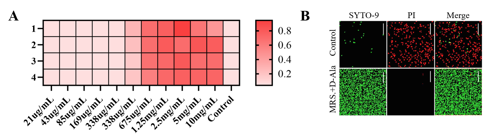
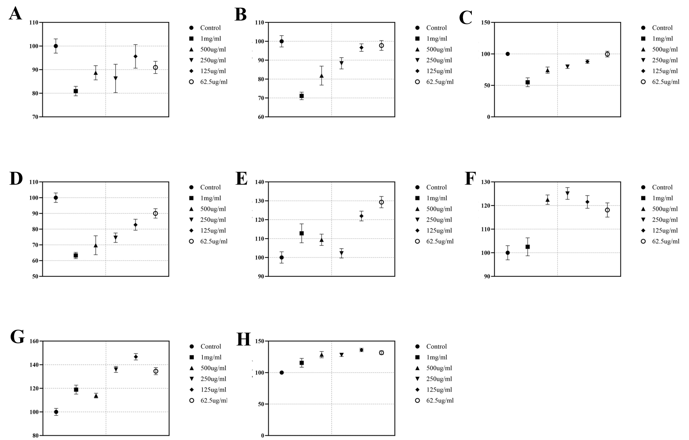
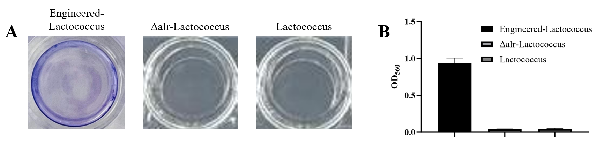
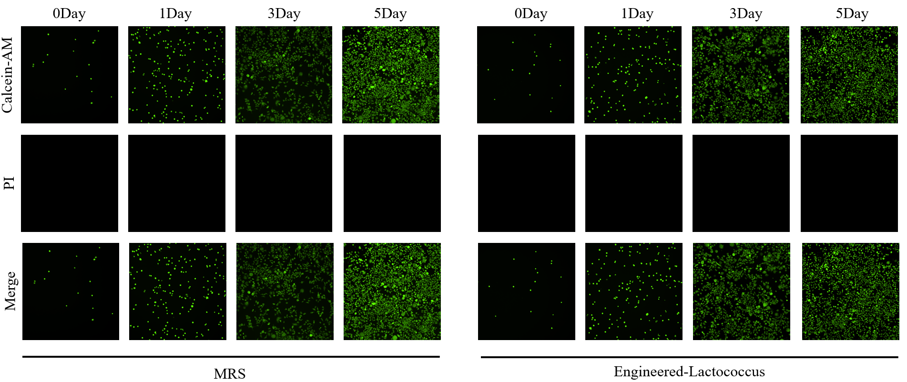

# Results

## Screening of Δalr-Lactococcus Culture System

MRS media containing different concentrations of D-alanine were prepared by the serial dilution method, and Δalr-*Lactococcus* was inoculated into a 96-well plate and cultured overnight. The OD600 measurement results showed that the group without D-alanine addition (Control group) exhibited no bacterial growth; when the D-alanine concentration was greater than 675 μg/mL, obvious bacterial growth appeared, and the group with a D-alanine concentration of 2.5 mg/mL had the highest OD600 value (Fig.1A). Therefore, subsequent experiments selected 2.5 mg/mL to prepare MRS medium.

The SYTO-9/PI staining results showed that after Δalr-*Lactococcus* was inoculated in the plate and cultured for 12 h, the medium was replaced with D-alanine-free MRS medium and normal MRS medium containing 2.5 mg/mL D-alanine, respectively. The MRS culture group without D-alanine exhibited obvious bacterial death, whereas the MRS culture group containing 2.5 mg/mL D-alanine showed good bacterial viability (Fig.1B).

*Fig.1 A. OD600 values of Δalr-Lactococcus cultured in MRS medium containing different concentrations of D-alanine. B. Bacterial SYTO-9/PI staining images; green represents live bacteria, and red represents dead bacteria.*

## Receptor Activity of ComD-NisK

After preliminary sequence screening, we obtained 8 candidate ComD-NisK sequences with the highest phosphokinase activity. Next, we used a reporter bacterium carrying the PnisA promoter and downstream tandem GFP to evaluate the levels of GFP expression initiated by the 8 ComD-NisK sequences under stimulation with the same concentration of *Streptococcus mutans* culture. The GFP expression percentage values of sequences SQ1 to SQ8 are represented by Fig.2A–Fig.2H, respectively, and the control group was a GFP signal with a fixed expression level. The results showed that the level of GFP expression initiated by SQ5 was higher; therefore, sequence SQ5 was selected as the final ComD-NisK sequence.

*Fig.2 GFP transcriptional quantification of different ComD-NisK sequences (SQ1–SQ8); A–H represent SQ1–SQ8, respectively.*

## Co-culture Test of Engineered Bacteria and Streptococcus mutans

Through the Transwell assay, engineered bacteria were co-cultured with *Streptococcus mutans*. *Streptococcus mutans* was cultured in the upper chamber, and engineered bacteria were cultured in the wells. After 24 h, the culture medium in the wells was collected and centrifuged to collect the supernatant. The OD560 measurement results showed that, compared with *Lactococcus lactis* and Δalr-*Lactococcus*, the culture supernatant of the engineered bacteria exhibited a significant blue signal that was visible to the naked eye.

*Fig.3 A. Well plate color after co-culture of engineered bacteria, Δalr-Lactococcus, and Lactococcus lactis with Streptococcus mutans. B. OD560 quantitative results.*

## Biocompatibility Test of Engineered Bacteria

The results of co-culture with NIH-3T3 cells through Transwell chambers for 1, 3, and 5 days showed that neither MRS medium alone nor engineered bacteria caused NIH-3T3 cell death, indicating that the engineered bacteria had good biosafety.

*Fig.4 Calcein-AM/PI staining images of NIH-3T3 cells co-cultured with MRS medium and engineered bacteria through Transwell chambers.*
